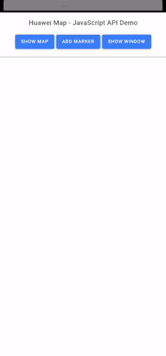
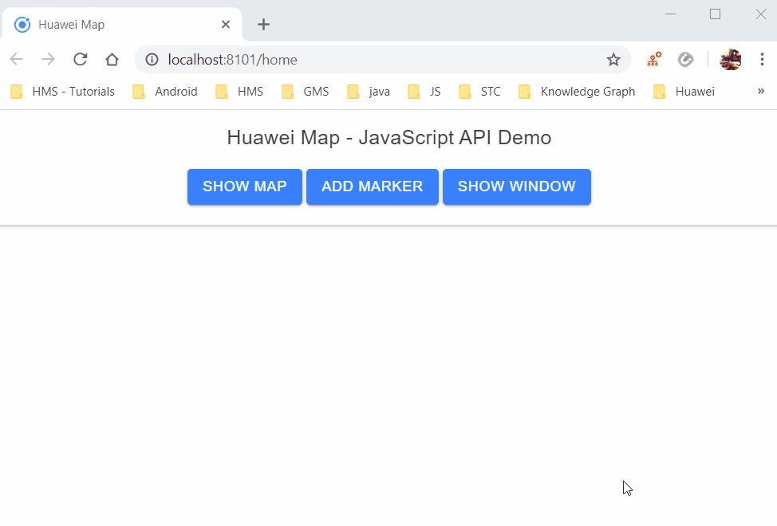

# Ionic HMS Map Demo
An Ionic sample integrated with HMS Map Kit JavaScript Api.



## Running the application

### Adding HMS API Key

1. Copy your API Key from following section 

```sh
AppGallery Connect > Your App > Develop > Overview > App Information > API key
```

2. Open src/index.html

3. Modify loadMapScript() function and paste your API Key here

```js
const apiKey = encodeURIComponent("YOUR_API_KEY");
const src = `https://mapapi.cloud.huawei.com/mapjs/v1/api/js?callback=initMap&key=${apiKey}`;

const mapScript = document.createElement('script');
mapScript.setAttribute('src', src);
document.head.appendChild(mapScript);
```

### Run Locally in a Web Browser

1. Add your HMS API Key

2. Install dependencies

```sh
cd ionic-hms-map-demo
npm install
```

3. Run following command and you can visit http://localhost:8100/ in your web browser to see the app in action

```sh
ionic serve
```

### Running on Android

1. Add your HMS API Key

2. Install dependencies

```sh
cd ionic-hms-map-demo
npm install
```

3. Build Ionic app with the following command

```sh
ionic build
```

4. Manually add the Android project.

```sh
npx cap add android
```

5. Build and run the Ionic App using Android Studio. Once Android Studio launches, you can build/emulate/run your app through the standard Android Studio workflow.

```sh
npx cap open android
```

If you are having issues, you can follow [getting started.](https://capacitor.ionicframework.com/docs/android/)

## HMS Map Kit JavaScript API

1. Provide the HUAWEI Map Kit API file. The key must be transcoded using the URL

```html
<script src="https://mapapi.cloud.huawei.com/mapjs/v1/api/js?callback=initMap&key=API KEY"></script>
```

2. Create map container elements in the body

```html
<div id="map"></div> 
```

3. Initialize the map. The following sample code is to create a map with Paris as the center and a zoom level of 8:

```js
function initMap() { 
    const mapOptions = {}; 
    mapOptions.center = {lat: 48.856613, lng: 2.352222}; 
    mapOptions.zoom = 8; 
    mapOptions.language='ENG'; 
    const map = new HWMapJsSDK.HWMap(document.getElementById('map'), mapOptions); 
} 
```

4. Adding Marker

```js
const mMarker = new HWMapJsSDK.HWMarker({ 
    map: map, 
    position: {lat: 48.85, lng: 2.35}, 
    label: 'A', 
    icon: { 
        opacity: 0.5 
    } 
}); 
```

5. Showing Information Window

```js
const infoWindow = new HWMapJsSDK.HWInfoWindow({ 
    map, 
    position: 10, 
    content: 'This is a InfoWindow.', 
    offset: [0, -40], 
}); 

infoWindow.open(mMarker); 

mMarker.addListener('click', () => { 
    infoWindow.open(mMarker); 
}); 
```




You can have more infromation from the official documentation of [Huawei Map Kit - JS API](https://developer.huawei.com/consumer/en/doc/development/HMS-Guides/hms-map-js-about-the-service) and you can integrate it in any JS based project.

